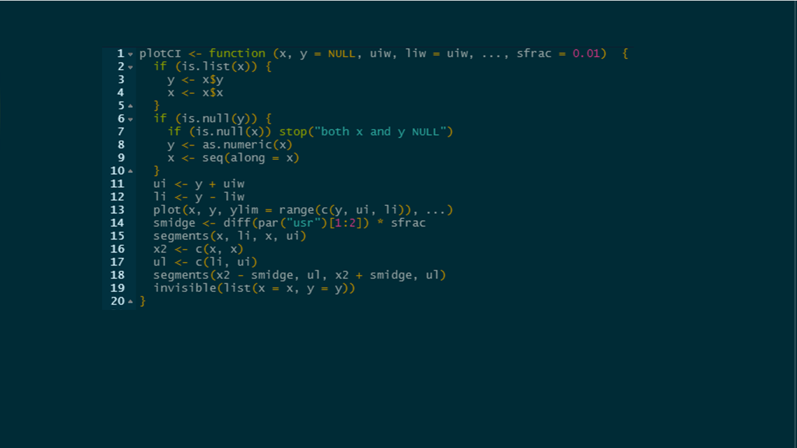
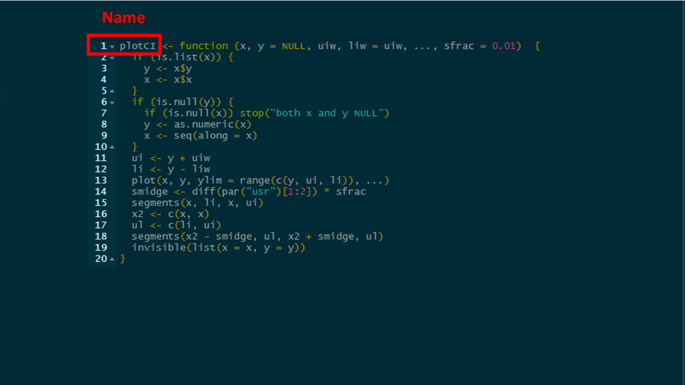
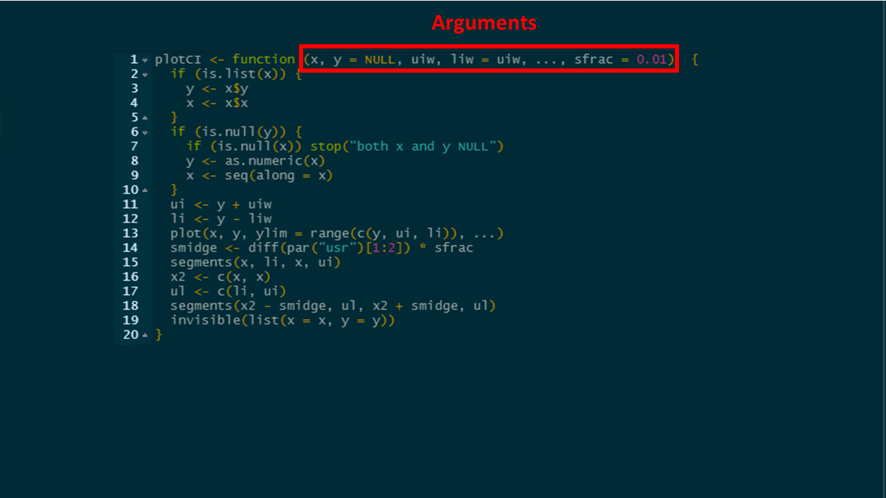
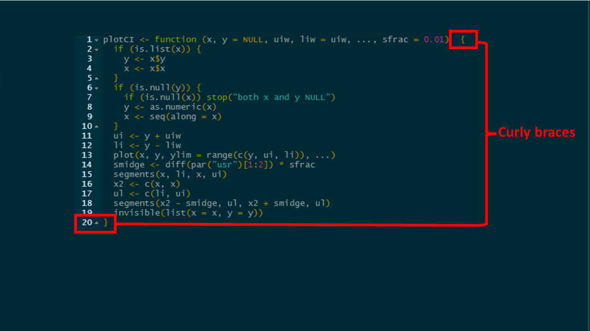
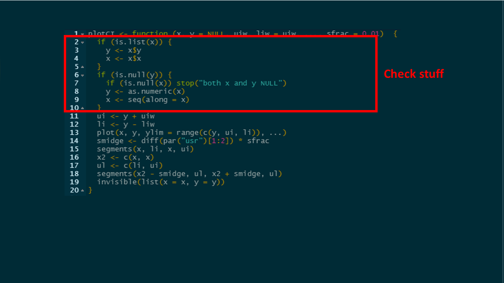
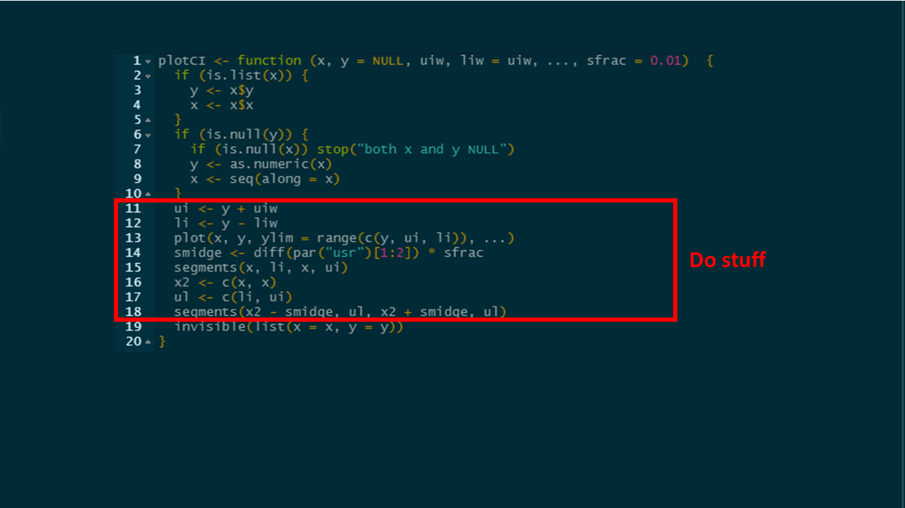
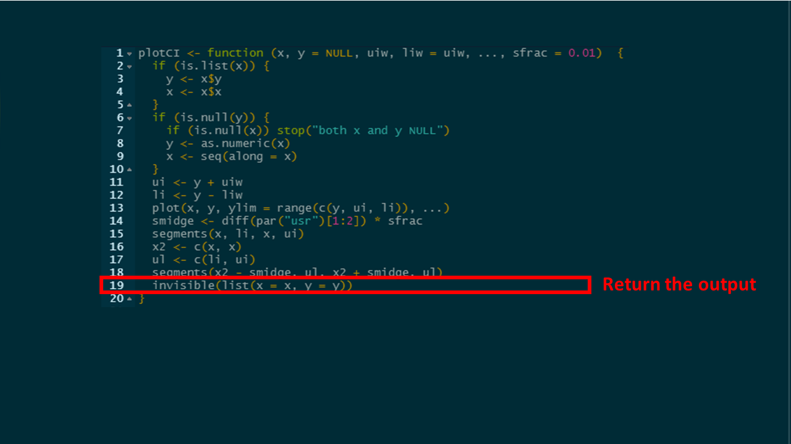
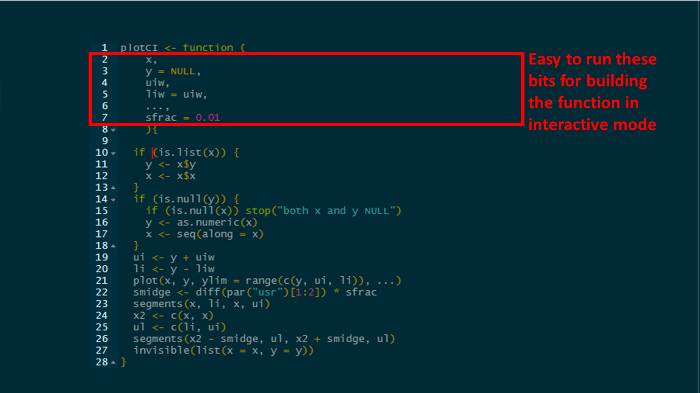
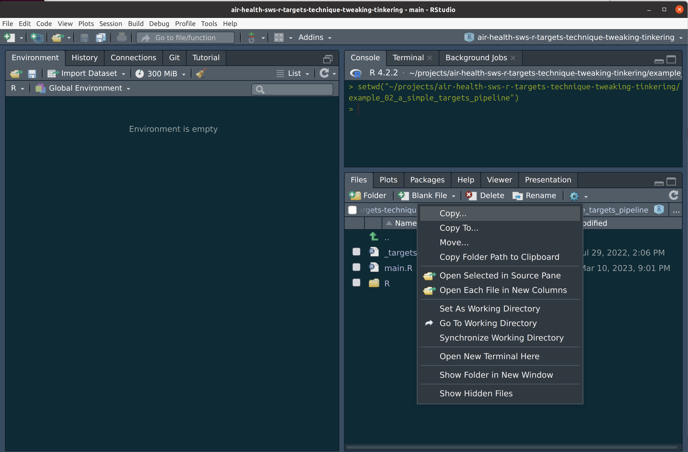

# Good R-functions recommendations

- Our recommendations for the technique for writing R functions using an example.
- The function case study is `plotCI`: contributed to the R community email list  by Bill Venables in September 1997 
- It shows some of the best practices for writing R functions


# Ex.1 The plotCI function

```{r, sl1, eval=T, echo = F, out.width="2400px"}

```

- It is a plot utility function to add confidence intervals or error bars to a dot plot
- The original post is archived at this website: https://stat.ethz.ch/pipermail/r-help/1997-September/001758.html


## The structure of a function: start with the name

```{r, sl2, eval=T, echo = F, out.width="2400px"}

```

- The name of the function comes first `plotCI` followed by the command that defines this as a `function`.

## The arguments

```{r, sl3, eval=T, echo = F, out.width="2400px"}

```


- Then the brackets enclose the `arguments` of the function `(x, y = NULL etc)`.


## The body

```{r, sl4, eval=T, echo = F, out.width="2400px"}

```

- Finally the curly braces `{` and `}` enclose the body of the function.

## Tip: do check that the inputs are as expected


```{r, sl5, eval=T, echo = F, out.width="2400px"}

```

- The first check is whether x is a list (and assumes it contains x and y variables)
- The second check is if y is NULL, in this case the y variable will have the values of x and the x variable will just indicate how many observations there are
- It is very clever to also check if x and y are NULL, nothing can be done and the function stops 

## Do stuff


```{r, sl6, eval=T, echo = F, out.width="2400px"}

```

## Return outputs


```{r, sl7, eval=T, echo = F, out.width="2400px"}

```


## Tip: put each argument on a separate line


```{r, sl8, eval=T, echo = F, out.width="2400px"}

```

- The argument `x` has no default value, however the argument `y` has the default setting of `NULL` which means that if the analyst does not supply any value for `y` when the function is called, then `y = NULL`.
- Likewise `uiw` has no default whereas `liw` does.  If `liw` is not supplied then it will take the value of `uiw`.

## R-targets pipeline recommendations (Ex.2 and Ex.3)

- This section will describe the technique of writing R-targets pipelines
- The second example will move on from Good Functions to a very simple demonstration of using simple functions in R-pipelines
- The third example shows aspects of "Good" function-oriented programming style that will make R-targets more elaborate whilst still being trustworthy

# Ex.2: a simple R-targets pipeline

- this example shows a simulation using a random sample from the normal probabilty distrubtion to generate a fake regression model and a plot

## Step 1: ensure the workspace is defined
```{r, ex2-sld1, eval=T, echo = F, out.width="2400px"}

```
- The first thing to do is to make sure the workspace is defined for the pipeline to run
- In this case we will use RStudio to set the `R working directory` pointed at the correct folder for Ex.02

## Step 2: recommendations for `main.R` as well as `_targets.R`

- In many cases a `main.R` script can be a useful method to control the pipeline and summarise aspcets of the development and assist writing the report
- The simple example here provides both a  `main.R` as well as `_targets.R` for inspection

# Ex.3: "Good" function-oriented programming style
